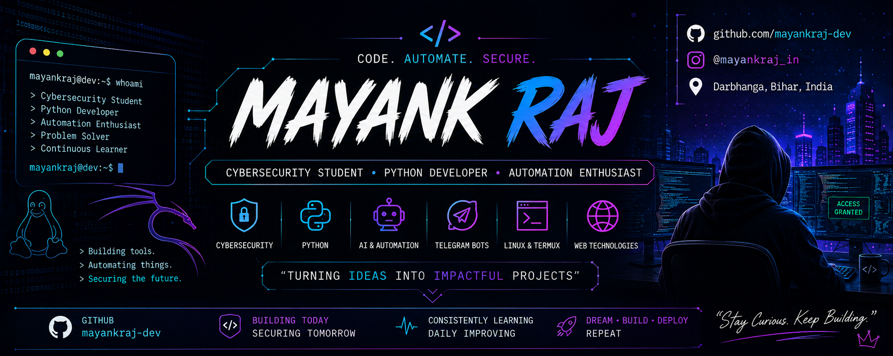

  

  

<h2 align="center">👾 Mayank Raj</h2>

  🔐 Cybersecurity Student &nbsp;•&nbsp; 🐍 Python Developer &nbsp;•&nbsp; 🤖 Automation Enthusiast

---

🧬 "whoami"

> Cybersecurity student
> Python developer
> Automation enthusiast
> Linux & Termux explorer
> Building • Learning • Experimenting

I'm interested in cybersecurity, Python, automation, AI-powered tools, Telegram bots, Linux and networking.

I enjoy learning by building things and turning ideas into working projects.

---

⚡ Current Focus

[+] Cybersecurity fundamentals
[+] Python & automation
[+] Linux & Termux
[+] Networking
[+] AI-powered tools
[+] Building real-world projects

---

🛠️ Tech Stack

Languages

"Python" "JavaScript" "HTML" "CSS" "Bash"

Tools

"Git" "GitHub" "Linux" "Termux" "VS Code"

Exploring

"Cybersecurity" "Networking" "Web Security" "AI Automation"

---

🚧 Projects

I'm currently building and experimenting with different projects.

🤖 Lumina

An AI-powered Telegram assistant project.

📝 FIGO Notemaker

A Telegram bot project focused on AI-assisted note making.

«More projects coming as I build and learn. 🚀»

---

🎯 Goals

- 🔐 Build a strong foundation in cybersecurity
- 🐍 Improve my Python skills
- 🌐 Learn networking and web security
- 🤖 Build useful automation tools
- ⭐ Contribute to open source
- 🚀 Turn ideas into real projects

---

📡 Connect

GitHub: "@mayankraj-dev" (https://github.com/mayankraj-dev)

Instagram: "@mayankraj_in" (https://instagram.com/mayankraj_in)

---

┌─────────────────────────────────────────┐
│  CODE. AUTOMATE. SECURE.                │
│                                         │
│  Stay curious. Keep learning. 👾        │
└─────────────────────────────────────────┘
