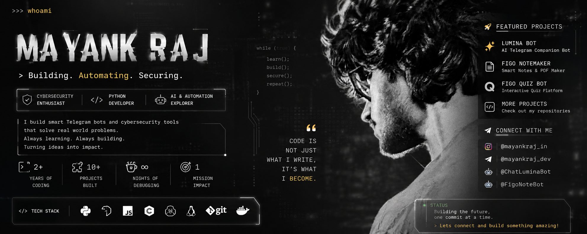

<div align="center">



<br><br>

# 👋 𝐇𝐢, 𝐈'𝐦 𝐌𝐚𝐲𝐚𝐧𝐤 𝐑𝐚𝐣

### `Cybersecurity Student` · `Python Developer` · `Automation Builder` · `Telegram Bot Developer`

<p>
  <a href="https://github.com/mayankraj-dev">
    
  </a>
  <a href="https://instagram.com/mayankraj_in">
    
  </a>
  <a href="https://t.me/mayankraj_dev">
    
  </a>
</p>

<p>
  
</p>

> **Build. Break. Learn. Secure. Repeat. ⚡**

</div>

---

## 🧠 About Me

I'm a **cybersecurity-focused student and developer** who enjoys turning ideas into working software, especially tools that combine **automation, AI, Telegram, APIs and practical security thinking**.

My development journey has moved through programming, web technologies, automation, hosting and bot development, with an increasing focus on **cybersecurity, Linux and security-minded engineering**.

I like building things that are not only functional, but also **usable, maintainable and resilient**.

```text
┌──────────────────────────────────────────────────────────┐
│  CURRENT MINDSET                                         │
│                                                          │
│  Learn → Build → Test → Break → Fix → Secure → Ship     │
│                                                          │
│  Focus: Cybersecurity + Python + Automation + AI Tools   │
└──────────────────────────────────────────────────────────┘
```

---

# ⚡ What I Do

<table>
<tr>
<td width="50%">

### 🛡️ Cybersecurity
- Security-minded development
- Linux & Kali Linux
- Bash & terminal workflows
- API/security fundamentals
- Defensive thinking
- Secrets & environment hygiene
- Debugging and failure analysis

</td>
<td width="50%">

### 🤖 Automation & AI
- AI-powered Telegram bots
- REST API integrations
- AI tools & workflows
- Web/search integrations
- Image/voice/vision workflows
- Automation scripts
- Practical developer tooling

</td>
</tr>

<tr>
<td>

### 🧑‍💻 Software Development
- Python applications
- JavaScript / TypeScript
- C / C++
- Java
- PHP
- HTML
- Database-backed applications

</td>
<td>

### 🌐 Web & Infrastructure
- Website designing
- Hosting & deployment
- WordPress
- Heroku
- Git / GitHub
- Linux environments
- Termux
- REST / HTTP services

</td>
</tr>
</table>

---

# 🏆 Highlights & Achievements

- 🎓 **Completed a 3-year Diploma in Civil Engineering**
- 🛡️ **Now focused on Cybersecurity**
- 🤖 Built and maintained **AI-powered Telegram bots**
- 🧠 Built tools around **AI, memory, study assistance and automation**
- 📚 Created knowledge-management and study-oriented Telegram tooling
- 🔌 Worked with **REST APIs and direct HTTP-based integrations**
- 🐧 Hands-on experience with **Linux, Kali Linux and Termux**
- 🌐 Explored **web development, hosting and deployment**
- 🧰 Built projects with practical features such as **rate limiting, retries, logging, model fallback and environment-based secrets**
- 🔍 Continuously experimenting with new developer and AI tools

> **I don't measure progress only by certificates — I measure it by what I can build, understand and secure.**

---

# 🚀 Featured Projects

## 🤖 𝐋𝐮𝐦𝐢𝐧𝐚 👀✨

**AI Telegram Companion · Study Assistant · Multimodal Bot**

[](https://t.me/ChatLuminaBot)
[](https://github.com/mayankraj-dev/Lumina-Ai-Chatbot)

A feature-rich Telegram AI companion designed around chat, study, memory and creative workflows.

**Core features:**

`💬 Smart Chat` `🧠 Memory` `👁️ Vision` `🎤 Voice`  
`📚 Study Mode` `📝 Notes` `🎨 Image Generation` `🌐 Web Search`  
`🎭 Personality Modes` `🏆 XP & Achievements` `📊 Leaderboard`  
`🛡️ Rate Limiting` `🔄 Model Fallback` `💾 SQLite` `🖥️ Clean Logs`

The project uses a lightweight architecture based around **Python, Telegram Bot API, REST/HTTP, SQLite and configurable AI services**.

---

## 📖 𝐅𝐈𝐆𝐎

**Personal Knowledge Vault · Note Maker · Study Tool**

[](https://t.me/FigoNoteBot)

FIGO is designed as a Telegram-based knowledge vault: save information, search it later, summarize it, organize it and turn saved material into useful study content.

**Feature universe:**

`📥 Universal Saving` `🔗 Web Scraping` `📄 File Extraction` `📸 OCR`  
`🔎 Smart Search` `🧠 TL;DR` `❓ Ask` `✍️ Rewrite` `💡 Explain`  
`📝 MCQ Generator` `🏷️ Auto Tags` `📌 Pins` `🚦 Priorities`  
`📁 Collections` `⏰ Reminders` `🗞️ Digests` `🔥 Streaks`  
`🗑️ Trash & Restore` `📦 Exports` `💬 AI Chat` `🎵 Music`  
`⚡ Inline Search` `☁️ Private Media Storage` `📡 Activity Logs`

---

## 🧩 Other Builds & Experiments

My development playground also includes experiments around:

- 🤖 Telegram automation
- 🧠 AI assistants and AI tools
- 🌐 Website design and hosting
- 🔌 REST API integrations
- 🐍 Python utilities and scripts
- 🖥️ Linux / Termux tooling
- 🔐 Cybersecurity learning projects
- ⚙️ Automation workflows
- 📊 Data and database experiments

> More projects are continuously being built, tested and refined.

---

# 🧰 My Tech Stack

<div align="center">

### 💻 Languages


<br>

### 🌐 Web & APIs


<br>

### 🗄️ Database


<br>

### 🛡️ Cybersecurity & Systems


<br>

### 🔧 DevOps / Tools


<br>

### 🤖 AI & Telegram


</div>

---

# 🧠 Cybersecurity Instincts

Security isn't just a toolset to me — it's a **way of thinking**.

```text
🔐 Never hard-code secrets
        ↓
🧩 Understand the attack surface
        ↓
🛡️ Apply least privilege
        ↓
🚦 Rate-limit abuse
        ↓
🔄 Expect failures
        ↓
🧾 Keep useful logs
        ↓
💾 Protect persistence & backups
        ↓
🧪 Test before trusting
```

### 🔎 My security-minded development checklist

- 🔐 Keep API keys, bot tokens and credentials outside source code
- 🧱 Treat external input as untrusted
- 🚦 Think about rate limits and abuse cases
- 🧯 Use defensive exception handling
- ⏱️ Use request timeouts
- 🔄 Plan for service/API failures
- 🧾 Keep high-level operational logs
- 👑 Restrict administrative operations
- 💾 Consider persistence, backups and data isolation
- 🧹 Avoid unnecessary data collection
- 🧪 Test edge cases instead of assuming the happy path
- 🐧 Use Linux/terminal tooling to understand systems more deeply

> **The goal isn't to make software look secure. The goal is to make security part of the engineering process.**

---

# 🧪 Current Learning Lab

<div align="center">

`CYBERSECURITY` → `LINUX` → `NETWORKING` → `PYTHON`  
`APIs` → `AUTOMATION` → `WEB` → `AI` → `SECURITY`

</div>

I'm especially interested in understanding how systems work underneath the interface — from **HTTP requests and APIs to Linux processes, automation, authentication, data storage and defensive security practices**.

---

# 📊 Development Philosophy

<table>
<tr>
<td align="center">

### 🧠 Learn
Understand the technology before blindly using it.

</td>
<td align="center">

### 🛠️ Build
Turn concepts into working projects.

</td>
<td align="center">

### 🧪 Test
Break things safely and learn why they fail.

</td>
<td align="center">

### 🛡️ Secure
Think about abuse, failure and privacy.

</td>
</tr>
</table>

---

# 🤝 Contributions & Open Source

I believe useful projects become better through collaboration.

### I'm interested in:

- 🐛 Bug reports
- 💡 Feature ideas
- 🔐 Security-minded improvements
- ⚡ Performance improvements
- 🧩 Automation ideas
- 📚 Documentation
- 🧪 Testing
- 🔧 Developer tooling

If you find something interesting in my repositories, feel free to **open an issue, suggest an improvement or contribute**.

### Contribution mindset

```bash
fork → branch → build → test → commit → pull request
```

**Keep it clean. Keep it useful. Keep it secure.**

---

# 🌐 Connect With Me

<div align="center">

<a href="https://github.com/mayankraj-dev">

</a>

<a href="https://instagram.com/mayankraj_in">

</a>

<a href="https://t.me/mayankraj_dev">

</a>

<br><br>

<a href="https://t.me/ChatLuminaBot">

</a>

<a href="https://t.me/FigoNoteBot">

</a>

</div>

---

# ⚡ Quick Terminal

```text
$ whoami

Mayank Raj

$ focus --current

Cybersecurity + Python + Automation + AI

$ build --status

████████████████████░  constantly evolving

$ security --mindset

Think like a builder.
Test like an attacker.
Defend like an engineer.

$ life --mode

learn()
build()
secure()
repeat()
```

---

<div align="center">

### 🛡️ `CYBERSECURITY` · 🤖 `AI` · 🐍 `PYTHON` · ⚡ `AUTOMATION`

### **Always learning. Always building.**

<br>


</div>
